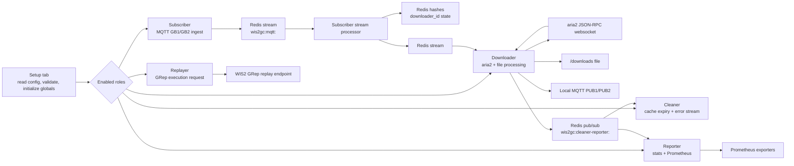

# WIS2 Global Cache Downloader Application Documentation

Generated from:

- Node-RED flow: `/Users/remy/Docker/WIS2/Downloader/projects/wis2gc/flows.json`
- Configuration file: `/Users/remy/Docker/WIS2/Downloader/setup/configuration.yml`

Date: 2026-06-28

## 1. Purpose

This Node-RED application implements a WIS2 Global Cache downloader service. It subscribes to WIS2 Notification Messages from one or two global brokers, filters and deduplicates messages, chooses download links, queues file downloads through Redis and aria2, validates downloaded files, republishes cached WNM messages to one or two local brokers, cleans cached files, emits Prometheus metrics, and can request replay from a WIS2 GRep endpoint.

The application is role-based. A single deployment can enable one or more of these roles:

- `SUBSCRIBER`: connect to global brokers and ingest WNM messages.
- `DOWNLOADER`: consume queued download jobs and publish cached messages.
- `CLEANER`: remove cached files and cancel stale aria2 downloads.
- `REPORTER`: aggregate download statistics and export Prometheus metrics.
- `REPLAYER`: submit replay requests based on current subscriber topics.

## 2. High-Level Architecture



## 3. Export Structure

The flow export contains 496 items across 7 tabs.

| Tab | Main responsibility |
|---|---|
| `CI/CD` | Maintains an `image:tag` file for container image versioning. |
| `Setup` | Reads YAML configuration, validates it, initializes Redis, connects MQTT brokers, stores runtime globals, writes a 2-second heartbeat, exposes `/get` and `/set`. |
| `Subscriber` | Subscribes to WIS2 topics, applies blacklist and replay normalization, deduplicates WNM IDs, writes messages to Redis streams, chooses download links, and builds downloader jobs. |
| `Downloader` | Consumes downloader jobs, controls aria2, tracks in-flight downloads, validates hashes, renames/uploads files, republishes cached WNM messages, and handles retries/errors. Publishes integrity failures and download errors to the reporter channel. |
| `Cleaner` | Watches Redis expiry events and cleaner-reporter pub/sub events to delete files or cancel stale downloads. Also reads error stream and performs periodic Redis cleanup. |
| `Reporter` | Aggregates cleaner-reporter events into 30-second Redis statistic windows, routes integrity failures and download errors to dedicated metric exporters, and exports Prometheus metrics. |
| `Replayer` | Builds replay requests from current subscriber topics and posts them to the configured WIS2 GRep endpoint. |

## 4. Runtime Dependencies

The export uses these notable Node-RED node types:

| Node family | Use |
|---|---|
| MQTT nodes | Global broker subscription and local broker publication. |
| Redis nodes | Streams, hashes, pub/sub, key expiry, deduplication, worker state, and metrics staging. |
| Dynamic websocket nodes | aria2 JSON-RPC websocket calls and status monitoring. |
| Prometheus exporter nodes | Download count, volume, delay, source, WMO-spec, integrity, and error metrics. |
| File/system functions | File rename, deletion, hashing, and S3 upload. |
| YAML nodes | Read and parse application configuration. |
| logIO nodes | Role-aware logging to dated log files. |

Function nodes also use runtime libraries such as `fs`, `path`, `crypto`, Redis cluster client, and `minio`.

## 5. Setup Flow

The `Setup` tab is the application entry point.

Startup sequence:

1. On start, `Check Config` reads `configuration.yml` once.
2. The YAML is parsed and passed to the `Validate` function.
3. If valid:
   - `global.config_valid = true`
   - a UUID is generated and stored as `global.uuid`
   - the main configuration file is read and parsed
   - role-specific initialization paths are triggered
4. If invalid:
   - `global.config_valid = false`
   - the app does not fully start role processing
5. Redis cluster keyspace notifications are configured with `notify-keyspace-events KEx`.
6. A separate `Init` inject fires immediately on startup and then every **2 seconds**. Each tick writes a heartbeat into the `wis2gc:setup:<queue>` hash (alive timestamp and UUID fields).

### Setup Redis State

The setup tab writes these fields into a Redis hash:

```text
wis2gc:setup:<queue>
```

Known fields include:

| Field | Meaning |
|---|---|
| `<worker>:alive` | Current worker heartbeat timestamp (epoch ms), updated every 2 seconds. |
| `<worker>:uuid` | Runtime UUID. |
| `<worker>:subscriber` | Subscriber topic configuration when subscriber role is enabled. |
| `<worker>:downloader` | Downloader role enabled marker. |
| `<worker>:cleaner` | Cleaner role enabled marker. |
| `<worker>:reporter` | Reporter role enabled marker. |
| `<worker>:replayer` | Replayer role enabled marker. |

The setup tab also creates a Redis stream consumer group:

```text
XGROUP CREATE <queue> <queue> $ MKSTREAM
```

This is used later by downloader workers.

### Runtime API

The setup tab exposes two HTTP endpoints.

#### `GET /get`

Returns current runtime configuration from global context.

Supported query:

```http
GET /get?key=<name>
```

Supported keys:

- `process-mode`
- `log-level`
- `worker`
- `queue`
- `whitelist` when `SUBSCRIBER` is enabled
- `blacklist` when `SUBSCRIBER` is enabled
- `global-replay` when `REPLAYER` is enabled
- `credentials` when `DOWNLOADER` is enabled — returns the current in-memory credential map (`global.download-creds`)

If no key is supplied, all keys available for the current roles are returned.

#### `POST /set`

Updates selected runtime settings without editing the YAML file.

Supported keys:

| Key | Accepted value | Effect |
|---|---|---|
| `process-mode` | `run` or `halt` | Controls whether subscriber, cleaner, reporter, and related processing continue. For subscriber, `run` reconnects MQTT and `halt` disconnects MQTT. |
| `log-level` | `info`, `warn`, or `debug` | Changes runtime log filtering. |
| `whitelist` | non-empty array of valid WIS2 MQTT topics | Replaces current subscriber whitelist while preserving replay topics. |
| `blacklist` | non-empty array of MQTT-like topic patterns | Replaces current subscriber blacklist. |
| `credentials` | CRUD object (see below) | Create, update, or delete a per-topic download credential in the shared Redis hash. Requires `DOWNLOADER` role. |

**Credentials CRUD object:**

```json
{ "op": "create", "topic": "origin/a/wis2/<centre-id>/data/recommended/...", "username": "user", "password": "pass" }
{ "op": "update", "topic": "origin/a/wis2/<centre-id>/data/recommended/...", "username": "user", "password": "newpass" }
{ "op": "delete", "topic": "origin/a/wis2/<centre-id>/data/recommended/..." }
```

- `op`: `create`, `update`, or `delete`.
- `topic`: must start with `origin/` and include `recommended` at level 6.
- `username`, `password`: required for `create` and `update`.

The change is written directly to the Redis hash `wis2gc:downloader:credentials` and propagates to all downloader instances within their next 10-second sync cycle. There is no immediate in-memory write.

**Partial success**: if a request body contains multiple keys and some are valid while others fail validation, the endpoint returns HTTP 200 with both a `changes` object (for successful keys) and an `errors` array (for failed keys). An all-failure request returns HTTP 400.

Runtime updates are validated. Unknown keys or values not available for the current roles return an HTTP error.

#### `POST /replayer`

Handles replay-specific operations. Unlike `/set`, this endpoint is **gated by the replayer primary election**: only the instance currently elected as replayer primary processes the request. Non-primary instances return HTTP 403.

Supported keys:

| Key | Accepted value | Effect |
|---|---|---|
| `global-replay` | non-empty string | Updates the active replay global cache identifier. |
| `replay` | object with `from` and `to` numbers in minutes | Triggers replay request generation. `from` must be greater than `to`, both must be ≥ 0. `to: 0` means "up to now". |

#### `GET /reporter/primary`

Returns HTTP 200 if this instance is currently the elected reporter primary, HTTP 404 otherwise. Used by load balancers or orchestrators to route reporter queries to the active instance.

#### `GET /replayer/primary`

Returns HTTP 200 if this instance is currently the elected replayer primary, HTTP 404 otherwise.

Improvement notes:

- `/set` and `/replayer` mutate global context but do not persist changes back to `configuration.yml`.
- Some accepted runtime keys, such as `process-mode`, are used in the flow but are not listed in the static YAML validator's known `global` fields as strongly as the runtime API supports them.

## 6. Subscriber Flow

The `Subscriber` tab ingests MQTT messages from up to two global brokers.

### Broker Subscription

The Setup tab dynamically connects:

- `GB1` from `subscriber.globalbroker[0]`
- `GB2` from `subscriber.globalbroker[1]`

Subscription topics come from `subscriber.mqtt.whitelist`.

If `subscriber.mqtt.global-replay` is set, Setup appends:

```text
replay/a/wis2/<global-replay>/<uuid>/#
```

Each configured topic is converted to:

```json
{ "topic": "<topic>", "qos": <qos> }
```

The flow reads `subscriber.mqtt.qos` if present, otherwise defaults to `0`. Note that `qos` is used by the flow but is not documented as a known key by the validator, so it may produce an "unused" warning depending on validation path.

### Ingest Path

For each global broker:

1. MQTT input receives WNM messages.
2. An `rbe` node suppresses repeated identical messages.
3. The `Black & GRep` function normalizes replay topics and applies blacklist patterns.
4. The message ID is deduplicated in Redis:

```text
SET wis2gc:subscriber:wnmid:<wnm.id> true NX EX 900
```

5. If the ID is new, the WNM is written to Redis stream:

```text
wis2gc:mqtt:<queue>
```

with fields:

- `topic`
- `payload`
- `timestamp`

The stream is capped with approximate max length `10000`.

### Blacklist Matching

Blacklist patterns support:

- `+` for exactly one topic level.
- `#` for all remaining levels.

Messages matching any blacklist pattern are silently dropped.

Replay topics beginning with `replay/a/wis2/` are normalized before blacklist matching by stripping the first 5 levels (`replay/a/wis2/<global-replay>/<uuid>`), leaving only the underlying WIS2 topic for matching.

### Redis Stream Processing

Every second, when subscriber role is active, the flow reads up to 500 messages from:

```text
wis2gc:mqtt:<queue>
```

starting from `global.lastMqttId`.

The `Process` function:

- converts Redis stream fields into message objects
- parses JSON payloads
- emits each message individually
- updates `global.lastMqttId`

### Downloader ID

For each WNM, the flow computes a `unique_id`:

- If `payload.properties.integrity.value` exists: first 12 characters of the integrity value after removing all `/` characters.
- Otherwise: all digit characters extracted from `payload.properties.pubtime`.

The `downloader_id` is then:

```text
payload.properties.data_id : payload.properties.pubtime : unique_id
```

This becomes `payload.downloader_id`.

### Link Ordering and Source Priority

The `Order links` function:

1. Moves links with `rel=canonical` or `rel=update` before other links (within the WNM `links` array).
2. Routes based on topic content:
   - Topics containing `origin/a/wis2` → output 1 immediately.
   - Topics containing `cache/a/wis2` → checks `properties.global-cache` against the `priority-global-cache` array:
     - If `priority-global-cache` is not set in global context, cache messages fall through to output 1.
     - If the cache is found at position N (0-indexed) in the array and N < 8, the message is sent to output N+2.
     - If the cache is not found in the array or is at position ≥ 8, the message is dropped (all outputs null).
3. Supports up to 8 cache priorities through outputs 2 to 9.

This produces a preference order:

1. Origin links first.
2. Preferred global caches in configured priority order.
3. Non-priority cache messages are ignored.

### GC Regulation Filtering

When `global.global-cache` is `true`, the `Action?` switch enforces the WIS2 GC cache flag:

- If `properties.cache = false` (nocache) and the downloader_id is seen for the first time: the WNM is stamped with `properties.global-cache = cache-name` and republished to local brokers, but **no download is queued**.
- If `properties.cache` is unset or `true`: normal download path.

When `global.global-cache` is `false` (non-GC subscriber), the `cache` flag in the WNM is ignored and all first-time messages are downloaded.

### Downloader State Creation

For each selected link, the subscriber writes state under:

```text
wis2gc:downloader:downloader_id:<downloader_id>
```

The state records:

| Field | Value |
|---|---|
| `<href_url>` | Initial value `queue-<source>` for the first link, `wait-<source>` for secondary links, updated to `complete-<source>` on success |
| `wnm` | Full WNM JSON string |
| `topic` | Original MQTT topic |
| `published` | WNM publish time (`properties.pubtime`) as an ISO-8601 string |
| `attempt` | Initialized to `1` |
| `stored` | Download completion epoch ms (written by Downloader) |
| `link` | Local file href (written by Downloader) |
| `length` | File size in bytes (written by Downloader) |

The `source` value in the href field tracks which data provider was used:

- `origin` for messages received on `origin/a/wis2` topics.
- The GC short name (e.g. `fr-meteofrance` from `fr-meteofrance-global-cache`) for messages received from a known cache.
- `unknown` for cache messages without a `global-cache` property.

It also uses:

```text
wis2gc:downloader:set:downloader_id:<downloader_id>
```

with `NX EX 900` as a short-term queue gate to prevent duplicate downloader enqueue.

Completed downloader IDs are skipped if:

```text
wis2gc:downloader:complete:downloader_id:<downloader_id>
```

already exists.

### Worker Queue

Download requests are pushed to the Redis stream:

```text
<global.queue>
```

Each stream entry carries three fields:

| Field | Value |
|---|---|
| `downloader_id` | Compound identifier for the logical download. |
| `href` | Download URL. |
| `topic` | Original WIS2 MQTT topic. Used by the Downloader to look up per-topic credentials. |

The queue is consumed by the Downloader tab.

Improvement notes:

- The subscriber has duplicated GB1/GB2 paths. Consider one subflow parameterized by broker index.
- `subscriber.mqtt.qos` is used but not listed as a first-class YAML option in the validator. Add it to the validator if it is intended.
- Blacklisted messages are dropped silently. A debug metric or optional counter would help operators understand filtering.

## 7. Downloader Flow

The `Downloader` tab consumes download jobs, sends aria2 requests, tracks aria2 completion, verifies files, and republishes cached messages.

### Worker Queue Consumption

Every 2 seconds, when the downloader role is active, the flow first checks whether there is work to do and capacity available using `XINFO STREAM <queue>` (inspects the pending-entry count) and `flow.inQueue < global.aria-inqueue`. Only when both conditions are met does it read from the queue.

Reading uses a **Redis consumer group** (`XREADGROUP`):

```text
XREADGROUP GROUP <queue> <worker> COUNT 30 STREAMS <queue> >
```

This replaces the earlier `XREAD`-based approach. Up to 30 entries are read per cycle. Each entry is acknowledged with `XACK` after processing.

A `First?` switch routes entries based on the stream ID format:

- IDs in `timestamp-sequence` format (e.g. `1749000000000-0`) are first deliveries from the XREADGROUP — they come from the Subscriber.
- IDs in `timestamp-99-random` format (e.g. `1749000000000-99-482301`) are re-queued retry entries generated by the retry path.

The flow handles control messages embedded in the stream:

- `action=delete`: delete `/downloads/<filename>`
- `action=cancel`: cancel aria2 download identified by `aria2_gid`

### Download Scheduling

For normal download jobs:

1. The `Href` function converts Redis stream entries into download objects.
2. A `Values` function maps flat Redis fields into message fields.
3. The flow checks `flow.inQueue` against `global.aria-inqueue`.
4. If capacity is available, it creates an aria2 JSON-RPC request:

```json
{
  "jsonrpc": "2.0",
  "method": "aria2.addUri",
  "id": "<stream_id>",
  "params": [
    "token:<aria-secret>",
    ["<href>"],
    {
      "out": "<filename>",
      "disk-cache": 0
    }
  ]
}
```

5. The filename is:

```text
<last colon-segment of downloader_id>_<last path segment of href>
```

6. A stream tracking hash is written:

```text
wis2gc:downloader:<worker>:stream_id:<stream_id>
```

where `stream_id` is the worker stream entry ID suffixed with a random 6-digit number.

7. A temporary expiry key is written:

```text
wis2gc:downloader:<worker>:stream_id:<stream_id>:expire
```

with TTL `900` seconds.

### Per-Topic Download Credentials

Some data sources require HTTP authentication. The downloader maintains a shared credential store in Redis and applies credentials per WIS2 topic.

**Startup loading.** When the downloader configuration is loaded, the `cred-config-prep` function reads `downloader.credentials` from the parsed YAML and writes all entries to the Redis hash:

```text
wis2gc:downloader:credentials
```

Field: WIS2 topic string (e.g. `origin/a/wis2/int-ecmwf/data/recommended/weather/...`).  
Value: JSON-stringified object, e.g. `"{\"username\":\"ecmwf_user\",\"password\":\"s3cr3t!\"}"`.

**Periodic sync.** Every 10 seconds (with an initial 5-second delay after startup), each downloader instance reads the full hash with `HGETALL` and rebuilds `global.download-creds` — a plain object keyed by topic. All downloader instances therefore share the same credential data with at most a 10-second lag after any change.

**aria2 injection.** When building the `aria2.addUri` JSON-RPC call, the `Aria` change node checks whether `global.download-creds` contains an entry for the download's topic. If it does, `http-user` and `http-passwd` are merged into the aria2 options object:

```json
{
  "out": "<filename>",
  "disk-cache": 0,
  "http-user": "<username>",
  "http-passwd": "<password>"
}
```

If no entry exists for the topic, aria2 receives no authentication options and proceeds unauthenticated.

**CRUD updates.** Runtime changes via `POST /set` with key `credentials` write directly to the Redis hash (HSET for create/update, HDEL for delete) without touching `global.download-creds` directly. The next periodic sync propagates the change to all instances.

### aria2 Websocket Handling

The downloader uses dynamic websocket nodes for aria2:

- Main `Download` websocket sends addUri and receives responses.
- One `Status` websocket watches completion.
- Another `Status` websocket watches errors.

On initial aria2 response:

1. The flow maps the returned aria2 GID back to the stream ID.
2. It writes:

```text
wis2gc:downloader:<worker>:aria2_gid:<gid>
```

3. It writes expiry key:

```text
wis2gc:downloader:<worker>:aria2_gid:<gid>:expire
```

with TTL `420` seconds.

On completion:

1. It reads aria2 GID state.
2. It acknowledges the worker queue entry.
3. It deletes stream/GID tracking keys.
4. It reads full downloader state by downloader ID.
5. It validates and stores the downloaded file.

On aria2 error:

1. It acknowledges and cleans tracking state.
2. It decrements `flow.inQueue`.
3. It enters the error/retry path.

### Hash Validation and File Placement

The `Hash` function:

1. Reads downloaded file size from the aria2 file path.
2. If WNM integrity metadata exists, computes a hash using the WNM integrity method.
3. Compares the base64 digest with WNM integrity value.
4. If hash matches or integrity value is `0`, marks `HASH_OK`.
5. If hash does not match:
   - deletes the file
   - marks `HASH_NOK`
6. If hashing or file-read fails, marks `FAIL` or `null`.

Rename/storage modes:

| Mode | Behavior |
|---|---|
| `rename-to: false` or unset | Keep file under aria2 download path. |
| `rename-to: date` | Move file into a date subdirectory derived from WNM `properties.pubtime`, formatted as `YYYY/MM/DD/HH`. |
| `rename-to: topic` | Move file into a subdirectory derived from WNM topic levels 3 onward (i.e. starting from the centre-id segment, after `wis2`). |
| `rename-to: s3` | Upload file to S3-compatible object storage, then delete local file. |

If target file already exists during date/topic renaming, the flow deletes the new download and marks `FAIL`.

The local href written to the republished WNM is:

- **S3 mode**: `<download-url>/<basename(filepath)>`
- **All other modes**: `<download-url>/<worker><filepath>`

### Republishing Cached WNM

When a download succeeds:

1. The flow writes completion state:

```text
wis2gc:downloader:complete:downloader_id:<downloader_id>
```

with TTL `21400` seconds.

2. It updates the downloader ID hash with:
   - `complete-<source>` as the href field value
   - `stored` timestamp (epoch ms)
   - local `link`
   - `length` (file size in bytes)

3. It publishes a completion event to Redis pub/sub channel:

```text
wis2gc:cleaner-reporter:<worker>
```

4. It **rebuilds** the WNM as a new object with:
   - a fresh random UUID as `id`
   - `conformsTo: ["http://wis.wmo.int/spec/wnm/1/conf/core"]`
   - `links[0].href` set to the local URL
   - `downloader_id` removed
   - `properties.global-cache` set to `global.cache-name`
   - the original geometry, properties, and remaining links preserved

5. It sets the MQTT topic by replacing the leading `origin` prefix with `cache` (using regex `/^origin/`). Cache-sourced topics are unchanged.

6. It publishes the rebuilt WNM to enabled local MQTT brokers:
   - `PUB1`
   - `PUB2`

### Retry and Error Logic

When a link fails or hash is bad, the flow:

1. Reads the downloader ID hash values.
2. The `Next` function evaluates the hash and sets a retry code on `msg.retry`:
   - `RETRY_OK`: a `wait-` link exists, `attempt ≤ 6`, and `error-nocache` is absent. The function converts `wait-` to `queue-`, the current `queue-` to `error-`, increments `attempt`, and sets `msg.delay = 5 × attempt` seconds (retry 1 = 5 s, retry 2 = 10 s, … retry 6 = 30 s).
   - `RETRY_NONEED`: a `complete-` link already exists — no action needed.
   - `RETRY_NOK`: no retryable link available (max retries reached or `error-nocache` set).
3. On `RETRY_OK`, the updated hash is written back, a delay is applied, and the job is re-queued to the worker stream with a 3-part stream ID (`timestamp-99-random`) that identifies it as a retry.
4. On `RETRY_NOK`, writes to error stream:

```text
wis2gc:error:<queue>:<worker>
```

with max length around `1000`.

The `attempt` field is initialized to `1` when the downloader state is first created by the Subscriber. The retry condition `attempt ≤ 6` allows up to 6 retries before a link is abandoned.

### Integrity Failure and Download Error Reporting

In addition to the retry/error path, the Downloader publishes metric events to the reporter channel for two specific failure cases.

**Integrity failure** (HASH_NOK): the `Bad hash` change node publishes:

```text
PUBLISH wis2gc:cleaner-reporter:<worker>
  ["type","integrity_fail","topic","<wnmtopic>"]
```

**Download error** (aria2 failure after all retries): the `Error` change node publishes:

```text
PUBLISH wis2gc:cleaner-reporter:<worker>
  ["type","download_error","topic","<wnmtopic>"]
```

Both go through the same Redis `Pub` node used for download completion events. The Reporter tab's `Type?` switch differentiates them from normal completion messages.

Improvement notes:

- Several TTLs are hardcoded: 900, 420, 7200, and 21400 seconds. Move them to named configuration options.
- Hash algorithms depend on WNM `integrity.method`; unsupported algorithms should be explicitly handled.
- The S3 local href uses `download-url + "/" + basename(filepath)`, while local file mode uses `download-url + "/" + worker + filepath`. Document expected public URL layout with examples in deployment docs.
- Worker queue and worker stream naming are easy to confuse because `global.queue` and `global.worker` are both Redis stream names in different contexts.

## 8. Cleaner Flow

The `Cleaner` tab performs three cleanup jobs.

### Redis Key Expiry Listener

At startup, when cleaner role is active, Redis keyspace events are subscribed using `psubscribe('__keyevent@0__:*')` on **all** Redis cluster nodes (not just masters):

The Setup tab enables keyspace notifications using:

```text
notify-keyspace-events KEx
```

When expiry events are received, the cleaner splits the expired key by `:` and inspects the parts.

If the key matches:

```text
wis2gc:cleaner-reporter:<worker>:expire:<filename>
```

(i.e. `items[1]="cleaner-reporter"` and `items[3]="expire"`) it pushes a delete action to the worker stream:

```text
<worker> * action delete filename <filename>
```

If the key matches:

```text
wis2gc:downloader:<worker>:aria2_gid:<gid>:expire
```

(i.e. `items[1]="downloader"`, `items[3]="aria2_gid"`, `items[5]="expire"`) it pushes a cancel action to the worker stream:

```text
<worker> * action cancel aria2_gid <gid>
```

### Cleaner-Reporter Pub/Sub

The cleaner also subscribes to:

```text
wis2gc:cleaner-reporter:*
```

When a downloaded file is reported and `rename-to-s3` is not enabled, the cleaner:

1. Strips the `/downloads/` prefix from the file path to get the filename.
2. Creates an expiry key:

```text
<pub/sub channel>:expire:<filename>
```

i.e. `wis2gc:cleaner-reporter:<worker>:expire:<filename>`, with TTL from `cleaner.keep-in-cache`.

When this key expires, the keyspace listener schedules the file delete action.

Note: the cleaner processes all messages on the `wis2gc:cleaner-reporter:*` channel. Messages with a `type` field (`integrity_fail`, `download_error`) do not have a file path and are ignored by the file-deletion logic, but they are still consumed without error.

### Error Stream Polling

Every 5 seconds, the cleaner reads:

```text
wis2gc:error:<queue>:<worker>
```

It parses error entries for debug logging and updates `global.lastErrorId`.

### Periodic Redis Cleanup

Every 21600 seconds (6 hours), the cleaner scans Redis and deletes stale keys with no TTL and idle time greater than 12 hours.

Patterns scanned:

- `wis2gc:downloader:*:stream_id:*`
- `wis2gc:downloader:*:aria2_gid:*`
- `wis2gc:downloader:downloader_id:*`
- `wis2gc:downloader:complete:*`

Improvement notes:

- The cleanup idle threshold is hardcoded to 12 hours.
- Cleaner action messages are sent to the worker stream identified by `items[2]` from the expired key, which must match the worker stream name used by the downloader.
- If Redis keyspace notifications are disabled or blocked on some cluster nodes, file expiry cleanup will not run correctly.

## 9. Reporter Flow

The `Reporter` tab aggregates completed downloads, routes failure events to dedicated metric exporters, and exports Prometheus metrics.

### Input

Reporter subscribes to:

```text
wis2gc:cleaner-reporter:*
```

It only processes messages when:

```text
global.reporter == true
global.process-mode == "run"
```

### Event Routing

All pub/sub messages arrive at the `Type?` switch, which inspects `payload.type`:

| `payload.type` value | Destination | Purpose |
|---|---|---|
| `integrity_fail` | `Hash` change node → `Hash` exporter | Increment integrity failure counter |
| `download_error` | `Error` change node → `Error` exporter | Increment download error counter |
| *(absent / other)* | `Stats` function | Normal download accumulation |

The `Hash` and `Error` change nodes each build a Prometheus `inc` payload with labels `centre_id` (extracted from the WNM topic at position 3) and `report_by` (from `global.cache-name`), with `val: 1`.

### Stats Windowing

The `HashStat` function runs a self-scheduling timer that fires at the next 30-second boundary (when wall-clock seconds reach 0 or 30). On each tick it:

1. Stores the **current** 30-second window key in flow context as `flow.hashstat`.
2. Emits the **previous** window key (30 seconds earlier) as `msg.payload` to trigger the `Metrics` function.

The `Stats` function accumulates incoming cleaner-reporter events into the **current** window using Redis `HINCRBY` and `HSET`. Window keys follow the pattern:

```text
wis2gc:stats:YYYYMMDDHHMMSS
```

where the seconds field is always 0 or 30.

For each cleaner-reporter event, the reporter stores:

Under the total hash:

```text
{<windowKey>}:total
```

Fields: `count`, `totalLength`, `totalDelay`.

Under the per-combo hash (one per `centreId` + `subtopic` pair):

```text
{<windowKey>}:combo:<centreId>:<subtopic>
```

Fields: `count`, `totalLength`, `totalDelay`, `lastTimestamp` (Unix seconds of the most recent successful download in this window, set with `HSET` rather than incremented).

Under the per-source hash (one per `centreId` + `source` pair):

```text
{<windowKey>}:src:<centreId>:<source>
```

Field: `count`. Tracks how many successful downloads came from each data source (e.g. `origin`, `fr-meteofrance`, another GC short-name) per centre.

All stat keys expire after 3600 seconds.

The `Metrics` function reads the **previous** window's keys after each timer tick, so each 30-second window is fully accumulated before being exported.

### K/V Function

Before accumulation, the `K/V` function converts the raw `HGETALL` array from a completed downloader hash into a structured object. It extracts:

- `length`: file size in bytes.
- `delay`: milliseconds between WNM `published` time (ISO-8601 string parsed via `new Date().getTime()`) and local `stored` time.
- `centreId`: 4th segment of the MQTT topic (position index 3).
- `subtopic`: 3 topic levels starting from level 6 (positions 5–7), e.g. `core/H/V`. This groups detailed sub-classifications into a manageable number of label values.
- `lastTimestamp`: `Math.floor(stored_ms / 1000)` — Unix timestamp in seconds of the download.
- `source`: extracted from the href field value by stripping the `complete-` prefix (e.g. `complete-origin` → `origin`).

### Prometheus Metrics

The application exports 8 Prometheus metrics across two groups.

**Monitor metrics** (per 30-second window, per `centreId` + `subtopic` combination):

| Metric | Type | Labels | Meaning |
|---|---|---|---|
| `monitor_wis2_gc_number_download_total` | counter | `centre_id`, `topic`, `report_by` | Number of files downloaded per centre and subtopic classification. |
| `monitor_wis2_gc_volume_download_total` | counter | `centre_id`, `topic`, `report_by` | Total bytes downloaded per centre and subtopic classification. |
| `monitor_wis2_gc_delay_download_timestamp_seconds` | gauge | `centre_id`, `topic`, `report_by` | Average delay in seconds from WNM publish time (`properties.pubtime`) to local storage time. |
| `monitor_wis2_gc_source_download_total` | counter | `centre_id`, `source`, `report_by` | Number of files successfully downloaded per data source (origin or GC short-name). |

**WMO spec metrics** (aggregated per `centreId`, no topic breakdown):

| Metric | Type | Labels | Meaning |
|---|---|---|---|
| `wmo_wis2_gc_downloaded_total` | counter | `centre_id`, `report_by` | Total files downloaded per centre (all subtopics summed). |
| `wmo_wis2_gc_last_download_timestamp_seconds` | gauge | `centre_id`, `report_by` | Unix timestamp (seconds) of the most recent successful download per centre. |
| `wmo_wis2_gc_downloaded_errors_total` | counter | `centre_id`, `report_by` | Number of download errors per centre. Incremented directly on each `download_error` event. |
| `wmo_wis2_gc_integrity_failed_total` | counter | `centre_id`, `report_by` | Number of integrity check failures per centre. Incremented directly on each `integrity_fail` event. |

The `Metrics` function emits monitor and WMO-spec metrics on separate outputs per window tick. The integrity and error WMO metrics are emitted immediately on each failure event, not batched by window.

## 10. Leader Election

Cleaner, Reporter, and Replayer roles each support multiple simultaneous instances. To prevent duplicate work (e.g. double-counting metrics or double-submitting replay requests), each role runs a continuous **leader election** to designate exactly one instance as primary.

### Heartbeat

Every 2 seconds, each role-enabled instance writes a heartbeat to the shared Redis hash:

```text
wis2gc:election
```

Fields written per instance:

| Field | Value |
|---|---|
| `<worker>:ts` | Current epoch ms (milliseconds). |
| `<worker>:uuid` | This instance's runtime UUID (generated once on startup). |
| `<worker>:cleaner` | `true` (only written by instances with CLEANER role). |
| `<worker>:reporter` | `true` (only written by instances with REPORTER role). |
| `<worker>:replayer` | `true` (only written by instances with REPLAYER role). |

### Election

Every 10 seconds, each instance reads the full `wis2gc:election` hash (`HGETALL`) and runs an election:

1. Parse all worker entries from the flat array.
2. Filter to workers with the relevant role field set to `true` and a `ts` within the last **8 seconds** (alive threshold).
3. Among those alive workers, select the one with the **lexicographically lowest UUID**.
4. If this instance's UUID matches the winner, set `global.<role>-primary = true`; otherwise `false`.
5. Any worker whose `ts` is older than **30 seconds** is considered stale — its fields are removed with `HDEL`.

Each role runs its own independent election. The same instance can be primary for multiple roles simultaneously.

### Effect

- `global.cleaner-primary`: when `true`, this instance performs the periodic Redis key cleanup (every 6 hours).
- `global.reporter-primary`: when `true`, this instance aggregates and exports Prometheus metrics.
- `global.replayer-primary`: when `true`, this instance processes `POST /replayer` requests. Others return HTTP 403.

## 11. Replayer Flow

The `Replayer` tab is triggered through the runtime `POST /replayer` endpoint, which is handled in the Setup tab and forwarded here only when this instance is the elected replayer primary.

Triggering a replay:

```json
{
  "replay": {
    "from": 120,
    "to": 0
  }
}
```

The `/replayer` handler converts minutes to an ISO datetime range:

- `from`: now minus `from` minutes
- `to`: now minus `to` minutes, or `..` when `to` is `0`

The replayer:

1. Scans Redis keys matching:

```text
wis2gc:setup:*
```

2. Reads all subscriber configurations from setup hashes. Both subscriber data formats are supported:
   - New format: array of `{"topic": "...", "qos": N}` objects.
   - Old format: plain array of topic strings.

3. Extracts subscriber topics, excluding topics beginning with `replay/a/wis2`.
4. Deduplicates topics.
5. Splits topics into individual requests.
6. Rate-limits requests to **one every 10 seconds**.
7. Posts to the configured WIS2 GRep endpoint (read from `global.global-replay-url`) with payload:

```json
{
  "inputs": {
    "datetime": "<from>/<to>",
    "subscriber-id": "<uuid>",
    "topic": "<topic>"
  }
}
```

## 12. CI/CD Flow

The `CI/CD` tab updates an `image:tag` file.

It reads environment variables:

| Env var | Meaning |
|---|---|
| `container` | Container image name. |
| `directory` | Directory containing `image:tag`. |

Behavior:

1. If `image:tag` does not exist, create `<container>:YYYY.M.1`.
2. If existing tag has the same year/month, increment patch.
3. If existing tag is older, advance to next month and patch `1`.
4. Write the new value to `image:tag`.

## 13. Redis Key Reference

| Key or pattern | Type | Purpose |
|---|---|---|
| `wis2gc:election` | hash | Shared leader election state. Fields: `<worker>:ts` (epoch ms), `<worker>:uuid`, `<worker>:cleaner`, `<worker>:reporter`, `<worker>:replayer`. Updated every 2 s per role; read every 10 s for election. No TTL — stale fields (>30 s) are HDEL'd by the election function. |
| `wis2gc:setup:<queue>` | hash | Worker heartbeat (every 2 s), UUID, and role setup state. |
| `wis2gc:mqtt:<queue>` | stream | Ingested WNM messages from global brokers. |
| `wis2gc:subscriber:wnmid:<id>` | string, TTL 900 | Subscriber-side WNM ID deduplication. |
| `wis2gc:downloader:credentials` | hash, no TTL | Shared per-topic download credentials. Field: WIS2 topic string. Value: JSON-stringified `{"username":"…","password":"…"}`. Written at startup from YAML and updated by CRUD operations via `/set`. Read every 10 s by each downloader to rebuild `global.download-creds`. |
| `wis2gc:downloader:downloader_id:<id>` | hash, TTL 7200 from subscriber path | Download state for one logical WNM/data object. Fields: per-href status, `wnm`, `topic`, `published` (ISO-8601 pubtime), `attempt` (init 1), `stored` (epoch ms), `link`, `length`. |
| `wis2gc:downloader:set:downloader_id:<id>` | string, TTL 900 | Queue gate to prevent duplicate downloader enqueue. |
| `wis2gc:downloader:complete:downloader_id:<id>` | string, TTL 21400 | Marks completed downloader ID. |
| `wis2gc:downloader:<worker>:stream_id:<id>` | hash | Maps aria2 addUri request stream ID to downloader state. |
| `wis2gc:downloader:<worker>:stream_id:<id>:expire` | string, TTL 900 | Expiry marker for stale aria2 request setup. |
| `wis2gc:downloader:<worker>:aria2_gid:<gid>` | hash | Maps aria2 GID to downloader state. |
| `wis2gc:downloader:<worker>:aria2_gid:<gid>:expire` | string, TTL 420 | Expiry marker used to cancel stale aria2 downloads. |
| `<worker>` | stream | Worker command/download queue (read by Downloader, written by Subscriber and Cleaner). |
| `<queue>` | stream/group | Redis stream group created by Setup. |
| `wis2gc:cleaner-reporter:<worker>` | pub/sub channel | Downloader events for cleaner and reporter. Normal completion carries file path; `integrity_fail` and `download_error` carry typed metric events with topic. |
| `wis2gc:cleaner-reporter:<worker>:expire:<filename>` | string, TTL `keep-in-cache` | File deletion timer. |
| `wis2gc:error:<queue>:<worker>` | stream | Downloader error stream. |
| `{wis2gc:stats:YYYYMMDDHHMMSS}:total` | hash | Reporter 30-second window totals. Fields: `count`, `totalLength`, `totalDelay`. Expires after 3600 s. |
| `{wis2gc:stats:YYYYMMDDHHMMSS}:combo:<centreId>:<subtopic>` | hash | Reporter per-centre per-subtopic stats. Fields: `count`, `totalLength`, `totalDelay`, `lastTimestamp` (Unix seconds). Expires after 3600 s. |
| `{wis2gc:stats:YYYYMMDDHHMMSS}:src:<centreId>:<source>` | hash | Reporter per-centre per-source download count. Field: `count`. Expires after 3600 s. |

## 14. Logging

Setup creates three log paths using logIO:

| Path | Active when `global.log-level` is | Output file pattern |
|---|---|---|
| Info | `info`, `warn`, or `debug` | `wis2gc-<sourceNode>-%DATE%.info.log` |
| Warn | `warn` or `debug` | `wis2gc-<sourceNode>-%DATE%.debug.log` |
| Debug | `debug` | `wis2gc-<sourceNode>-%DATE%.debug.log` |

`sourceNode` is the originating node name normalized to lowercase letters only.

Log files are written to `/logs`, rotated hourly, compressed (gzip), capped at 200 MB (info/warn) or 100 MB (debug), and kept for 25–26 files.

Note: the Warn path writes to a `.debug.log` filename (confirmed in the flow — the change node overrides the filename inline). Both Warn and Debug messages share `.debug.log` files, differentiated only by the logIO-logger log level filtering. The logIO-logger named "Warn" has a default filename of `wis2gc-%DATE%.warn.log` but this default is overridden per-message before the node is reached.

## 15. Separate Configuration Reference

This section documents the usable options shown in `configuration.yml` and supported by the flow/validator.

### Top-Level Structure

```yaml
global:
subscriber:
downloader:
cleaner:
replayer:
```

The validator also accepts a `reporter` top-level section as known, but the current sample does not use it and no reporter options are read from YAML.

### `global`

```yaml
global:
  roles: SUBSCRIBER,DOWNLOADER,CLEANER,REPLAYER,REPORTER
  worker: worker3
  queue: queue1
  log-level: info
  localbroker:
    - broker: mqtts://emqx1:8883
      username: everyone
      password: everyone
    - broker: mqtts://emqx2:8883
      username: everyone
      password: everyone
```

| Option | Type | Required | Accepted values / default | Used by |
|---|---|---:|---|---|
| `global.roles` | string | yes | Comma-separated roles: `SUBSCRIBER`, `DOWNLOADER`, `CLEANER`, `REPORTER`, `REPLAYER` | Enables tabs/features. |
| `global.worker` | string | yes | Example `worker3` | Worker stream name and worker-specific Redis keys. |
| `global.queue` | string | yes | Example `queue1` | Shared Redis queue/group name and MQTT ingest stream suffix. |
| `global.log-level` | string | yes | `info`, `warn`, `debug` | Runtime log filtering. |
| `global.localbroker` | array | recommended | Up to 2 wired brokers | Local MQTT brokers PUB1/PUB2 used for cached WNM publication. |
| `global.localbroker[].broker` | string | yes per broker | `mqtt://`, `mqtts://`, `ws://`, or `wss://` URL | Dynamic MQTT connection. |
| `global.localbroker[].username` | string | warned if missing | Any non-empty string | MQTT auth. |
| `global.localbroker[].password` | string | warned if missing | Any non-empty string | MQTT auth. |
| `global.localbroker[].version` | number | no | `3`, `4`, or `5`; default `4` | MQTT protocol version. |
| `global.localbroker[].verifycert` | boolean | no | default `false` in flow | TLS server certificate verification. |
| `global.test-mode-duration` | number | no | Number | Validator accepts it, but no active flow usage was identified. |
| `global.global-cache` | boolean | no | default `false` | When `true`, enables GC regulation enforcement: messages with `properties.cache=false` are republished but not downloaded. |

Flow-supported runtime option not shown in sample YAML:

| Option | Type | Accepted values | Notes |
|---|---|---|---|
| `process-mode` | string | `run`, `halt` | Exposed by `/get` and `/set`. Setup defaults to `run` when absent. Used by subscriber/cleaner/reporter. |

### `subscriber`

```yaml
subscriber:
  globalbroker:
    - broker: mqtts://globalbroker.meteo.fr
      username: everyone
      password: everyone
    - broker: mqtts://globalbroker.inmet.gov.br
      username: everyone
      password: everyone
  priority-global-cache:
    - jp-jma-global-cache
    - data-metoffice-noaa-global-cache
  mqtt:
    whitelist:
      - origin/a/wis2/jp-jma-gts-to-wis2/#
    blacklist:
      - +/+/+/de-dwd-gts-to-wis2/#
```

| Option | Type | Required | Accepted values / default | Used by |
|---|---|---:|---|---|
| `subscriber.globalbroker` | array | yes when `SUBSCRIBER` | Up to 2 wired brokers | Global MQTT brokers GB1/GB2. |
| `subscriber.globalbroker[].broker` | string | yes | `mqtt://`, `mqtts://`, `ws://`, or `wss://` URL | Dynamic MQTT connection. |
| `subscriber.globalbroker[].username` | string | warned if missing | Any non-empty string | MQTT auth. |
| `subscriber.globalbroker[].password` | string | warned if missing | Any non-empty string | MQTT auth. |
| `subscriber.globalbroker[].version` | number | no | `3`, `4`, or `5`; default `4` | MQTT protocol version. |
| `subscriber.globalbroker[].verifycert` | boolean | no | default `false` in flow | TLS server certificate verification. |
| `subscriber.priority-global-cache` | array of strings | no | Up to 8 useful entries | Determines preferred cache order for cache-originated WNM messages. If absent, all cache messages are treated equally (output 1). |
| `subscriber.mqtt` | object | yes | Contains topic options | Subscriber topic setup. |
| `subscriber.mqtt.whitelist` | array of strings | yes | Valid WIS2 MQTT topic filters | Topics subscribed to on GB1/GB2. |
| `subscriber.mqtt.blacklist` | array of strings | no | MQTT-like filters using `+` and `#` | Messages matching are dropped. |
| `subscriber.mqtt.global-replay` | string or null | no | Replay global cache ID | Adds `replay/a/wis2/<value>/<uuid>/#` to subscriptions. |
| `subscriber.mqtt.qos` | number | no | default `0` | Used by Setup to build subscription objects, but not listed as a known field in validator. |

Whitelist validation rules:

- Level 1 must be `origin`, `cache`, `monitor`, or `+`.
- Level 2 must be `a` (literal; `+` is rejected here).
- Level 3 must be `wis2` (literal; `+` is rejected here).
- Level 4 must contain at least one `-` and be lowercase alphanumeric with hyphens, or `+`.
- Level 5 must be `data`, `metadata`, or `+`.
- `#` must be the final level.
- Other literal segments must be lowercase alphanumeric with optional hyphens.

Blacklist validation is looser:

- Entries must be strings.
- Allowed characters: letters, numbers, hyphen, slash, `+`, `#`.

### `downloader`

```yaml
downloader:
  aria-secret: secret
  aria-url: ws://aria2:6800/jsonrpc
  aria-inqueue: 200
  cache-name: fr-meteofrance-global-cache
  download-url: https://globalcache.meteo.fr
  rename-to: topic
  s3access:
    url: http://garage:3900
    accesskey: ...
    secretkey: ...
    bucket: global-cache
    region: garage
```

| Option | Type | Required | Accepted values / default | Used by |
|---|---|---:|---|---|
| `downloader.aria-secret` | string | yes | aria2 RPC token | Builds `token:<secret>` for aria2 JSON-RPC calls. |
| `downloader.aria-url` | string | yes | `ws://...` or `wss://...` | Dynamic websocket URL for aria2. |
| `downloader.aria-inqueue` | number | yes | Positive integer | Max in-flight aria2 queue size. |
| `downloader.cache-name` | string | warned if missing | Global cache name | Written to WNM `properties.global-cache`; reporter uses as `report_by` label on all Prometheus metrics. |
| `downloader.download-url` | string | yes | `http://...` or `https://...` | Base public URL used in republished WNM link href. |
| `downloader.rename-to` | string or false | no | `date`, `topic`, `s3`, or `false`; absent means no renaming | File placement/storage strategy. |
| `downloader.s3access` | object | required only when `rename-to: s3` | S3-compatible settings | Uploads downloaded files and removes local copy. |

S3 options:

| Option | Type | Required | Notes |
|---|---|---:|---|
| `downloader.s3access.url` | string | yes for S3 | `http(s)://host(:port)`; split into endpoint, port, and SSL flag. |
| `downloader.s3access.accesskey` | string | yes for S3 | S3 access key. |
| `downloader.s3access.secretkey` | string | yes for S3 | S3 secret key. |
| `downloader.s3access.bucket` | string | yes for S3 | Target bucket. |
| `downloader.s3access.region` | string | recommended | MinIO may use a default if absent. |

Important behavior:

- If `rename-to` is not `s3`, `s3access` is ignored and the validator warns.
- If `rename-to: s3`, `s3access` becomes mandatory.
- Date/topic renaming fails if the target file already exists.

### `cleaner`

```yaml
cleaner:
  keep-in-cache: 180
```

| Option | Type | Required | Accepted values / default | Used by |
|---|---|---:|---|---|
| `cleaner.keep-in-cache` | number | yes when `cleaner` section exists | Seconds; `<= 0` means immediate deletion warning | TTL before downloaded files are scheduled for deletion. |

Notes:

- When `CLEANER` role is enabled and the `cleaner` section is missing, the validator warns that files will not be cleaned from cache.
- Cleaner file deletion is bypassed for S3 mode because the downloader uploads and deletes local files immediately.

### `replayer`

```yaml
replayer:
  global-replay-url: https://wis2-grep.weather.gc.ca/processes/wis2-grep-subscriber/execution
```

| Option | Type | Required | Accepted values / default | Used by |
|---|---|---:|---|---|
| `replayer.global-replay-url` | string | yes when `replayer` section exists | HTTP or HTTPS URL | Intended replay endpoint. |

Important current mismatch:

- The validator checks `replayer.global-replay-url`.
- The Replayer tab currently hardcodes the replay endpoint in a change node instead of reading this option from global context.

### `reporter`

The validator treats `reporter` as a known top-level section, but no reporter configuration options are currently defined or read from YAML. Reporter activation is controlled by including `REPORTER` in `global.roles`.

## 16. Sample Configuration Interpretation

For the provided `configuration.yml`, the application is configured to:

- Enable all roles: subscriber, downloader, cleaner, replayer, reporter.
- Use worker stream `worker3`.
- Use queue/group `queue1`.
- Log at `info` level.
- Publish cached messages to two local MQTT brokers: `emqx1` and `emqx2`.
- Subscribe to two global brokers: Meteo-France and INMET.
- Prioritize four named global caches when choosing cache-originated messages.
- Whitelist Japanese GTS-to-WIS2 origin/cache topics.
- Blacklist several centres and all `recommended` topics matching `+/+/+/+/+/recommended/#`.
- Download through aria2 at `ws://aria2:6800/jsonrpc` with max 200 in-flight jobs.
- Publish cached hrefs under `https://globalcache.meteo.fr`.
- Rename files by WIS2 topic path (path starts from the centre-id segment).
- Keep local cached files for 180 seconds before cleaner deletion.
- Configure S3 credentials, though S3 is ignored because `rename-to` is `topic`, not `s3`.

## 17. Operational Checklist

Before deployment:

- Validate `configuration.yml` through the Setup validator.
- Confirm `REDIS_URL` is present in the Node-RED environment.
- Confirm Redis cluster accepts `CONFIG SET notify-keyspace-events KEx`.
- Confirm only two global brokers and two local brokers are expected, because only GB1/GB2 and PUB1/PUB2 are wired.
- Confirm `aria-url` is reachable from Node-RED.
- Confirm `/downloads` exists and is writable by the Node-RED runtime.
- Confirm public `download-url` maps to files generated by the selected `rename-to` mode.
- Confirm MQTT TLS certificate policy. The flow defaults `verifycert` to false when absent.
- Confirm `process-mode` is `run` after startup.
- Connect all `prometheus-exporter` nodes to their corresponding `prometheus-metric-config` nodes via the Node-RED editor UI. The 8 metric config nodes are not auto-linked on import.

Runtime checks:

- `GET /get` returns expected role-specific values.
- `wis2gc:setup:<queue>` contains alive and role fields and updates every ~2 seconds.
- `wis2gc:election` contains ts, uuid, and role fields for each running worker and updates every ~2 seconds.
- `GET /reporter/primary` returns 200 on the instance elected as reporter primary.
- `GET /replayer/primary` returns 200 on the instance elected as replayer primary.
- `wis2gc:mqtt:<queue>` receives subscriber messages.
- Downloader queue `<queue>` consumer group has active consumers.
- aria2 websocket reports connected.
- `wis2gc:cleaner-reporter:<worker>` publishes completion events.
- Prometheus metrics increase after successful downloads.
- `wmo_wis2_gc_integrity_failed_total` increments on hash mismatches.
- `wmo_wis2_gc_downloaded_errors_total` increments on aria2 failures.

